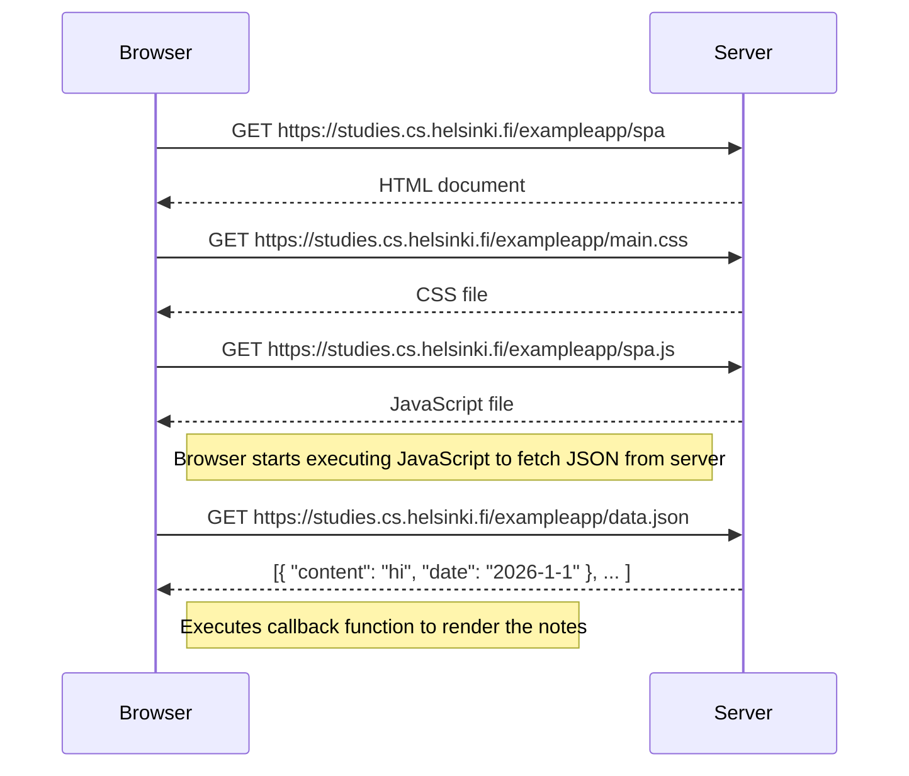

```mermaid
sequenceDiagram

Browser->>Server: GET https://studies.cs.helsinki.fi/exampleapp/spa
Server-->>Browser: HTML document
Browser->>Server: GET https://studies.cs.helsinki.fi/exampleapp/main.css
Server-->>Browser: CSS file
Browser->>Server: GET https://studies.cs.helsinki.fi/exampleapp/spa.js
Server-->>Browser: JavaScript file
Note right of Browser: Browser starts executing JavaScript to fetch JSON from server
Browser->>Server: GET https://studies.cs.helsinki.fi/exampleapp/data.json
Server-->>Browser: [{ "content": "hi", "date": "2026-1-1" }, ... ]
Note right of Browser: Executes callback function to render the notes
```
